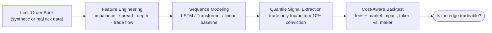
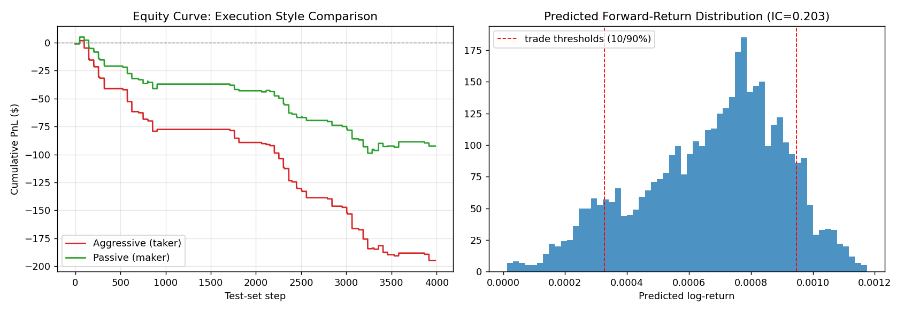

<div align="center">

# 📈 LOB-Alpha

### Machine Learning Alpha Extraction from High-Frequency Limit Order Book Data

*Feature engineering → sequence modeling → quantile signal extraction → cost-aware backtesting*

[](https://github.com/Kartik281204/lob-alpha/actions/workflows/ci.yml)
[](https://www.python.org/)
[](https://pytorch.org/)
[](https://scikit-learn.org/)
[](#license)

[Overview](#overview) • [Results](#results) • [Quick Start](#quick-start) • [Methodology](#methodology) • [Project Structure](#project-structure) • [Roadmap](#roadmap)

</div>

---

## Overview

**LOB-Alpha** is an end-to-end research pipeline for extracting short-horizon
trading signals from high-frequency limit-order-book (LOB) microstructure
data — the same workflow used by quant research desks, built around
standard tools (`qlib`-style IC evaluation, `FinRL`-style execution
simulation) and standard rigor (chronological train/val/test splits,
linear-baseline benchmarking, honest cost accounting).

It answers the question every microstructure alpha project has to answer
sooner or later: **does the signal survive contact with real transaction
costs?**



**Why synthetic data?** Real tick-level LOB feeds (LOBSTER, NASDAQ ITCH)
are paywalled or require exchange membership. `simulate_lob.py` generates
a statistically realistic order book — jump-diffusion mid-price, Poisson
order arrivals across 5 price levels per side, market-order trade flow —
with a small, noisy order-flow-imbalance → price-drift effect injected,
the real phenomenon these features are built to detect (Cont, Kukanov &
Stoikov, 2014). Swap in a real data loader without touching anything
downstream; every module speaks the same standardized schema.

---

## Results

Single run, `seed=7`, 20,000 simulated LOB events, 50-step prediction horizon.

<table>
<tr><td>

**Signal quality**

| Metric | Value |
|---|---|
| Out-of-sample Information Coefficient | **0.203** |
| Model selected | Ridge baseline¹ |
| Trade quantile | top/bottom 10% |
| Directional win rate (pre-cost) | 44.9% |

</td><td>

**Backtest, by execution style**

| Style | Trades | Win rate | Profit factor |
|---|---|---|---|
| Aggressive (taker) | 33 | 15.2% | 0.07 |
| Passive (maker) | 33 | 27.3% | 0.35 |

</td></tr>
</table>

<div align="center">

</div>

¹ *The pipeline always benchmarks the deep model (LSTM/Transformer or its
offline MLP fallback) against a linear baseline on the validation set and
selects whichever wins on IC — in this run, Ridge won. This is deliberate:
microstructure signals are frequently close to linear, and reporting that
honestly is worth more than forcing a "the neural net wins" narrative.*

### The honest takeaway

An IC of 0.20 is a strong signal by HFT standards, and it's directionally
real: mean realized return was positive following long signals and
negative following short signals. But the edge is roughly **one bid-ask
spread wide** — so even passive (maker) execution, which avoids the
spread-crossing cost entirely, doesn't fully recover it. This is a common,
well-documented outcome in real microstructure research, not a bug in the
pipeline, and it's exactly the finding that motivates real HFT systems to
invest heavily in *execution* (queue position, fill-probability modeling,
rebate capture) rather than stopping at signal discovery. See
[Roadmap](#roadmap) for how this project would close that gap.

---

## Quick Start

```bash
git clone https://github.com/Kartik281204/lob-alpha.git
cd lob-alpha
pip install -r requirements.txt          # core -- runs the full pipeline offline
python -m src.pipeline
```

Want the real LSTM/Transformer instead of the scikit-learn fallback?

```bash
pip install -r requirements-torch.txt    # core + PyTorch
python -m src.pipeline                   # auto-detected, no code changes needed
```

Runs in a few seconds on CPU with the default 20,000-step simulation and
prints the full pipeline trace: feature engineering → model training →
model selection → signal extraction → backtest, for both execution styles.

```
1) Simulating 20,000 LOB events...
2) Engineering microstructure features...
3) Building rolling sequences...
4) Training linear baseline (Ridge) for comparison...
5) Training deep model (torch available: False)...
6) Selecting best model by validation IC...
7) Converting predictions to trading signal (top/bottom 10% quantile)...
8) Backtesting with transaction costs, both execution styles...
```

No `torch`? No problem — `models.py` auto-detects it and falls back to a
tuned scikit-learn MLP so the pipeline runs identically either way.

---

## Methodology

### 1 · Feature Engineering — `src/features.py`
Four standard microstructure feature families, all computed **causally**
(no lookahead):

| Family | Features |
|---|---|
| Order imbalance | level-1, depth-weighted, cumulative top-5 |
| Spread dynamics | raw/relative spread, rolling Δspread, microprice deviation |
| Depth ratios | bid/ask ratio per level, cumulative depth ratio |
| Trade flow | signed volume, trade intensity, VWAP deviation |

### 2 · Labeling
Continuous forward log-return over a 50-step horizon — **not** a hard
{-1, 0, 1} class. Thresholded classification throws away the magnitude
information needed to rank predictions by conviction, and real
microstructure signals have a weak per-prediction IC (typically
0.02–0.15) that only becomes tradeable once you filter down to the
highest-confidence subset.

### 3 · Modeling — `src/models.py`
- `LSTMAlpha` / `TransformerAlpha` — real PyTorch architectures (stacked
  LSTM or transformer encoder over a 20-step feature window → MLP
  regression head). Used automatically whenever `torch` is installed.
- `SklearnMLPAlpha` / `LinearAlpha` — offline fallback and linear
  baseline, using last-value + rolling mean/std window summaries.

### 4 · Model Selection
Deep model vs. linear baseline, picked by validation-set IC. No
assumption that "more parameters wins" — the pipeline lets the data decide.

### 5 · Signal Extraction
Only the top/bottom 10% of predictions by confidence become long/short
signals (`quantile_signal`) — the standard way weak-but-real HFT alpha is
actually deployed.

### 6 · Backtesting — `src/backtest.py`
Event-driven, with:
- **Fees** — flat bps of notional per fill
- **Slippage** — square-root market impact (Almgren-Chriss style), scaled
  by order size relative to top-of-book depth
- **Two execution styles**, compared side by side:
  - *Aggressive (taker)* — crosses the spread every entry/exit
  - *Passive (maker)* — posts at the touch, pays impact only (idealized;
    ignores resting-order fill probability — see [Roadmap](#roadmap))

---

## Project Structure

```
lob-alpha/
├── .github/workflows/
│   └── ci.yml             # lint + test on every push (Python 3.10-3.12, + torch job)
├── src/
│   ├── simulate_lob.py    # synthetic LOB generator — swap for a real data loader
│   ├── features.py        # order imbalance · spread dynamics · depth ratios · trade flow
│   ├── models.py           # LSTM / Transformer (PyTorch) + MLP / Ridge fallback
│   ├── backtest.py         # event-driven backtest — fees + market-impact slippage
│   └── pipeline.py          # end-to-end runner
├── tests/                   # pytest suite (see Testing & CI below)
├── outputs/
│   └── results.png          # equity curves + prediction diagnostic
├── requirements.txt          # core deps
├── requirements-torch.txt    # core + PyTorch (real LSTM/Transformer)
├── requirements-dev.txt      # core + pytest/ruff
└── README.md
```

---

## Roadmap

- [ ] **Real data loader** — LOBSTER / ITCH parser feeding the same schema
- [ ] **Fill-probability modeling for passive orders** — the real
      constraint separating paper alpha from tradeable alpha
- [ ] **Larger-scale training** — 200k+ steps to let the deep models
      out-learn the linear baseline
- [ ] **`qlib` / `FinRL` integration** — multi-asset backtesting and live
      trading simulation on top of the existing feature matrix

---

## Testing & CI

46 tests across five suites — simulator invariants (no crossed book, reproducibility,
positivity), feature bounds and causality, model fit/predict contracts, backtest
cost mechanics, and an end-to-end pipeline smoke test — run automatically on
every push via [GitHub Actions](.github/workflows/ci.yml) across Python 3.10–3.12,
plus a separate job that installs real PyTorch and re-runs the model tests
against the actual `LSTMAlpha`/`TransformerAlpha` classes.

```bash
pip install -r requirements-dev.txt
ruff check src tests        # lint
pytest -v                   # full suite
pytest -m "not slow" -v     # skip the end-to-end pipeline smoke test
```

---

## License

MIT — see [LICENSE](LICENSE).

<div align="center">
<sub>Built as a research/portfolio project exploring deep learning for microstructure alpha discovery.</sub>
</div>
